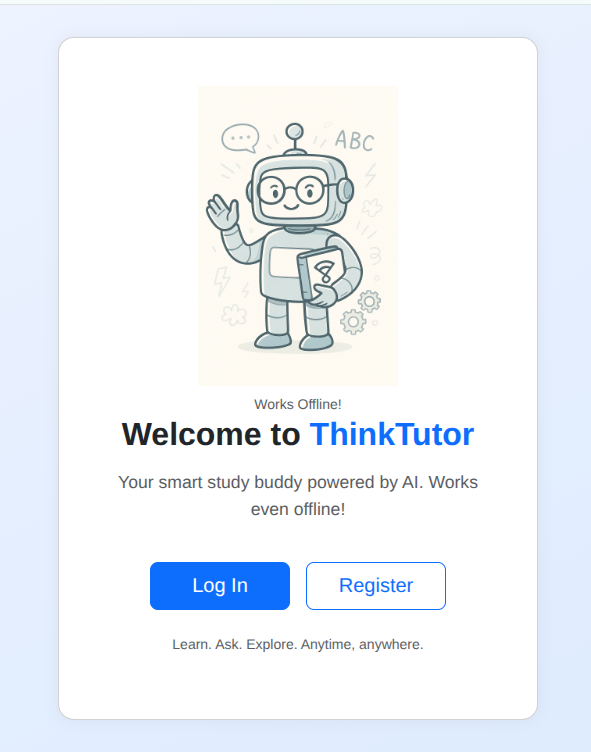
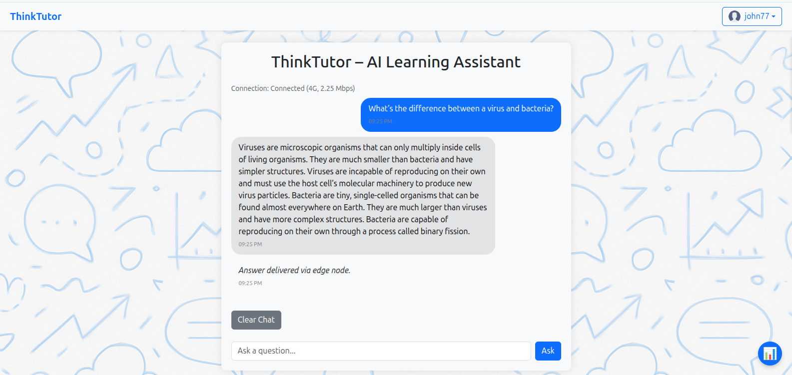
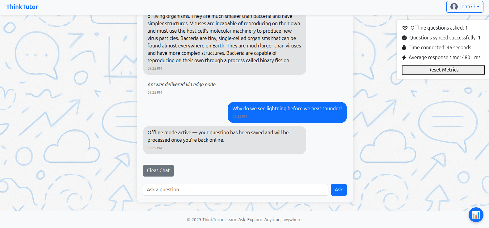
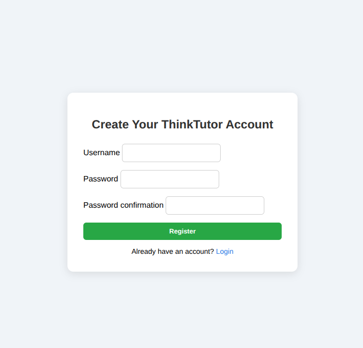

# ThinkTutor

**AI-powered, edge-ready tutoring platform using AWS Generative AI**

---

## Table of Contents

- [Overview](#overview)
- [Screenshots](#screenshots)
- [Features](#features)
- [Architecture](#architecture)
- [Getting Started](#getting-started)
  - [Prerequisites](#prerequisites)
  - [Installation](#installation)
  - [Running Locally](#running-locally)
- [Usage](#usage)
- [Project Structure](#project-structure)
- [Offline Capabilities](#offline-capabilities)
- [Metrics & Monitoring](#metrics--monitoring)
- [Contributing](#contributing)
- [License](#license)

---

## Overview

**ThinkTutor** is a modern AI-powered tutoring platform designed to work seamlessly online and offline. Built with Django and AWS Bedrock (Generative AI), it enables students to ask questions, receive instant, context-aware answers, and track their learning progress — all with edge-readiness for robust, low-latency experiences.

---

## Screenshots

### 🔹 ThinkTutor Homepage


### 🔹 Online Chat Interface


### 🔹 Offline Sync Experience


### 🔹 Login/Register Page


---

## Features

- **AI Tutoring**: Chat interface that leverages AWS Generative AI to answer questions accurately and conversationally.
- **Offline Support**: Users can ask questions offline; questions are queued and automatically synced when connectivity is restored.
- **Edge-Readiness**: Designed for low-latency deployment, ideal for environments with intermittent connectivity.
- **Progress Metrics**: Tracks questions asked, offline/online syncs, connection uptime, and average response times.
- **User Authentication**: Supports user accounts for a personalized learning experience.
- **Modern UI**: Responsive, clean interface using Bootstrap 5.

---

## Architecture

- **Frontend**: HTML/Bootstrap 5, Vanilla JavaScript
  - Chat UI with real-time feedback and offline queueing.
  - Metrics dashboard for monitoring engagement and connectivity.

- **Backend**: Django Framework (Python)
  - Modular apps: `ai_tutor`, `lessons`, `users`, `main`.
  - Handles authentication, question processing, and user management.
  - Integrates with AWS Bedrock via `ai_tutor/bedrock_client.py` for AI-powered responses.

- **AI Integration**: AWS Bedrock
  - Secure, scalable generative AI for tutoring and Q&A.

- **Offline/Sync**: 
  - LocalStorage for chat history and queued questions.
  - Automatic processing and sync when network returns.

---

## Getting Started

### Prerequisites

- Python 3.8+
- Django 4.x+
- Node.js & npm (for frontend tooling, optional)
- AWS credentials (with Bedrock access)
- [pip](https://pip.pypa.io/en/stable/)

### Installation

1. **Clone the repository:**
   ```bash
   git clone https://github.com/harmardir/ThinkTutor.git
   cd ThinkTutor
   ```

2. **Install Python dependencies:**
   ```bash
   pip install -r requirements.txt
   ```

3. **Configure AWS credentials** for Bedrock (refer to AWS documentation).

4. **Apply migrations:**
   ```bash
   python manage.py migrate
   ```

5. **Collect static files:**
   ```bash
   python manage.py collectstatic
   ```

### Running Locally

```bash
python manage.py runserver
```
Visit [http://localhost:8000](http://localhost:8000) in your browser.

---

## Usage

- **Ask a Question**: Type your question in the chat box and submit. If online, you'll get an AI-powered answer instantly. If offline, your question is saved and answered when you reconnect.
- **Metrics Panel**: Toggle the metrics panel to see your usage stats: number of questions, offline/online syncs, average response time, and total connected time.
- **Clear Chat & Metrics**: Use the "Clear Chat" button to reset history and stats.

---

## Project Structure

```
ThinkTutor/
├── ai_tutor/             # AI logic and AWS Bedrock client
│   └── bedrock_client.py
├── core/                 # Django project config
│   ├── settings.py
│   ├── wsgi.py
│   └── asgi.py
├── lessons/              # Lessons app (extendable)
├── main/                 # Main app and homepage templates
│   └── templates/
│       └── main/
├── static/               # Static files (JS, CSS, images)
│   └── js/
│       └── ask-ai.js     # Core chat logic, offline support, metrics
├── users/                # User management app
├── templates/            # Top-level HTML templates
├── requirements.txt      # Python dependencies
└── README.md
```

---

## Offline Capabilities

- **Queueing**: When offline, questions are stored in the browser (`localStorage`).
- **Syncing**: Upon reconnection, queued questions are sent to the server and answered automatically.
- **Persistence**: Chat history and metrics persist across sessions until cleared.

---

## Metrics & Monitoring

The metrics panel tracks:
- **Offline questions asked**
- **Questions synced successfully**
- **Time connected**
- **Average AI response time**

All metrics are stored in the browser and resettable by the user.

---

## Contributing

Pull requests are welcome! For major changes, please open an issue first to discuss your ideas.

To contribute:
1. Fork the repository.
2. Create a new branch (`git checkout -b feature/your-feature`).
3. Commit your changes (`git commit -m 'Add your feature'`).
4. Push to the branch (`git push origin feature/your-feature`).
5. Open a pull request.

---

## License

This project is licensed under the [MIT License](LICENSE).

---

**ThinkTutor** – Empowering learners everywhere, even at the edge!